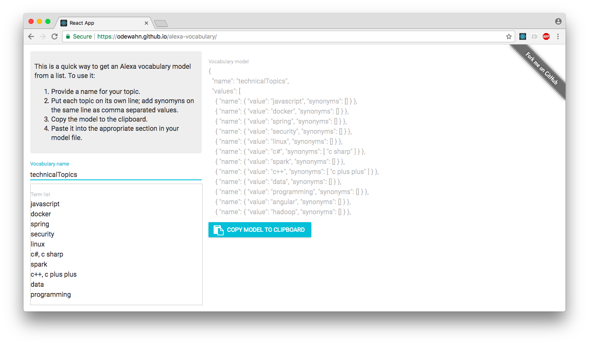

# Bulk Alexa Vocabulary Editor

[Alexa Vocabulary](https://odewahn.github.io/alexa-vocabulary/) is a simple app for uploading Alexa custom slot types:

* You enter a list of topics, one per line.  Add synonyms as a comma separated list.
* Copy the JSON model for the list
* Paste it into your model file

## Developing

This is a super bare bones tool with lots of room for improvement.  If your inclined to work on it:

* Clone the repo
* `npm install`
* `npm start`
* Make your changes
* Send me a pull request

I'm not fussy, but please don't eject this and send me a "better" webpack setup.
